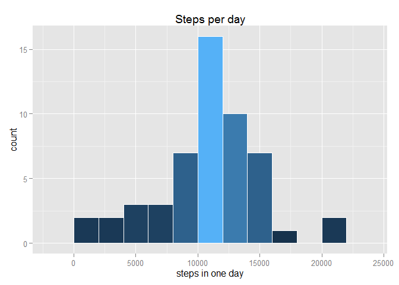
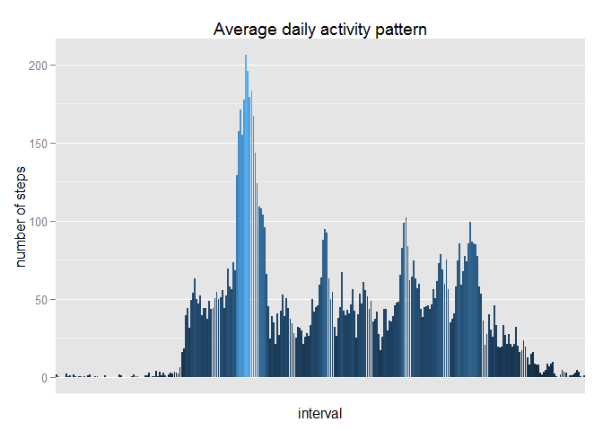
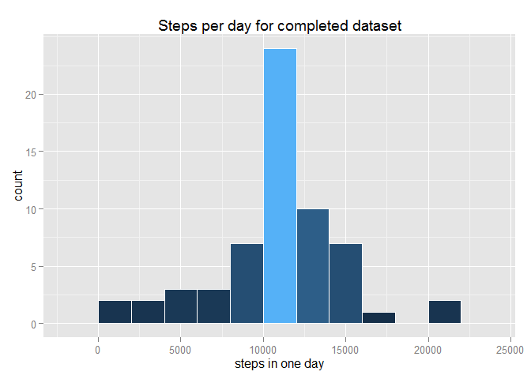
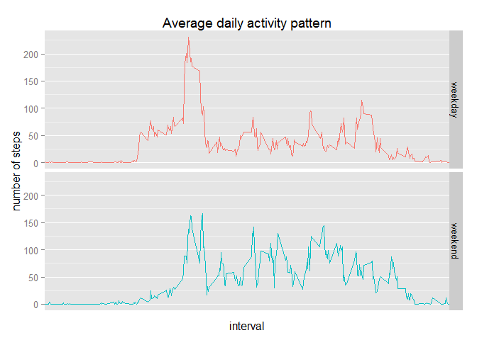

# Reproducible Research: Peer Assessment 1
Author: Matthew Moy de Vitry

## Libraries and directory

```r
library(ggplot2)
setwd("C:/Users/Matthew Moy/Documents/GitHub/RepData_PeerAssessment1")
```

## Loading and preprocessing the data

```r
data <- read.table("data/activity.csv",
                   sep=',',header=T)
summary(data)
```

```
##      steps                date          interval     
##  Min.   :  0.00   2012-10-01:  288   Min.   :   0.0  
##  1st Qu.:  0.00   2012-10-02:  288   1st Qu.: 588.8  
##  Median :  0.00   2012-10-03:  288   Median :1177.5  
##  Mean   : 37.38   2012-10-04:  288   Mean   :1177.5  
##  3rd Qu.: 12.00   2012-10-05:  288   3rd Qu.:1766.2  
##  Max.   :806.00   2012-10-06:  288   Max.   :2355.0  
##  NA's   :2304     (Other)   :15840
```


## What is mean total number of steps taken per day?

```r
# Aggregate by interval, doiing an average
data.byday <- aggregate(formula=steps~date,data=data,FUN=sum,na.rm=T)

plot.hist <- ggplot(data.byday,aes(x=steps, fill=..count..)) +
  geom_histogram(binwidth=2000,colour='white') +
  scale_y_continuous(breaks=seq(0,20,5))+
  theme(legend.position="none") + 
  labs(title="Steps per day", x='steps in one day')
plot.hist
```

 

```r
ggsave('figure/histogram.png',plot = plot.hist,width=4, height=3)

mean.daily <- mean(data.byday$steps, na.rm=T)
median.daily <- median(data.byday$steps, na.rm=T)
```
mean: 1.07662\times 10^{4}
median: 1.0765\times 10^{4}

## What is the average daily activity pattern?

```r
# Aggregate by interval, doiing an average
data.byinterval <- aggregate(formula=steps~interval, data=data, FUN='mean', na.rm=T)
# data.byinterval$interval <- as.POSIXlt(sprintf('%04d',data.byinterval$interval), format='%H%M')

plot.daily <- ggplot(data.byinterval,aes(x=as.factor(interval), y=steps, fill=steps)) +
  geom_bar(stat='identity', position = 'stack') +
  theme(legend.position="none") + 
  labs(title="Average daily activity pattern") + 
  scale_x_discrete(breaks=NULL) +
  xlab('interval') +
  ylab('number of steps')
plot.daily
```

```
## Warning: position_stack requires constant width: output may be incorrect
```

 

```r
ggsave('figure/daily_pattern.png',plot = plot.daily,width=10, height=5)
```

```
## Warning: position_stack requires constant width: output may be incorrect
```

```r
# The interval with highest average number of steps is:  
data.byinterval[which.max(data.byinterval$steps),]
```

```
##     interval    steps
## 104      835 206.1698
```

## Imputing missing values

### Number of missing values

```r
missing <- sum(is.na(data$steps))
```
The number of missing measurements is {r missing}.

### Imputation strategy

Our strategy fills missing data with the average value for the given interval.


```r
fillMissing <- function(data, data.byinterval){
  # find location of missing data
  which.missing <- which(is.na(data$steps))
  # fill with replacement values
  data[which.missing,'steps'] <- data.byinterval[data.byinterval$interval %in% data[which.missing, 'interval'],'steps']
  
  # return data
  return(data)
}
```

### Create new dataset and analyze


```r
data.filled <- fillMissing(data, data.byinterval)

# Aggregate by interval, doiing an average
data.filled.byday <- aggregate(formula=steps~date,data=data.filled,FUN=sum,na.rm=T)

plot.hist <- ggplot(data.filled.byday,aes(x=steps, fill=..count..)) +
  geom_histogram(binwidth=2000,colour='white') +
  scale_y_continuous(breaks=seq(0,20,5))+
  theme(legend.position="none") + 
  labs(title="Steps per day for completed dataset", x='steps in one day')
plot.hist
```

 

```r
ggsave('figure/histogram-filled.png',plot = plot.hist,width=4, height=3)

mean.daily.filled <- mean(data.filled.byday$steps, na.rm=T)
median.daily.filled <- median(data.filled.byday$steps, na.rm=T)
```

mean: 1.07662\times 10^{4} (original:1.07662\times 10^{4})
median: 1.07662\times 10^{4} (original:1.0765\times 10^{4})

The imputation procedure has no or negligible impact on the mean and median of total steps per day, respectively.

## Are there differences in activity patterns between weekdays and weekends?

```r
data.filled$day <- weekdays(as.POSIXct(data.filled$date, format='%Y-%m-%d'),T)
data.filled$day[data.filled$day %in% c('Sat','Sun')] <- 'weekend'
data.filled$day[!data.filled$day %in% 'weekend'] <- 'weekday'
data.filled$day <- as.factor(data.filled$day)

data.filled.byinterval <- aggregate(formula=steps~day+interval, data = data.filled, FUN='mean')

plot.weekday <- ggplot(data.filled.byinterval, aes(x=interval, y=steps, colour=day)) +
  geom_line()+
  theme(legend.position="none") + 
  labs(title="Average daily activity pattern") + 
  scale_x_discrete(breaks=NULL) +
  xlab('interval') +
  ylab('number of steps') + 
  facet_grid(day~.)
plot.weekday
```

 

```r
ggsave('figure/daily_pattern-weekday.png',plot = plot.weekday,width=8, height=6)
```

